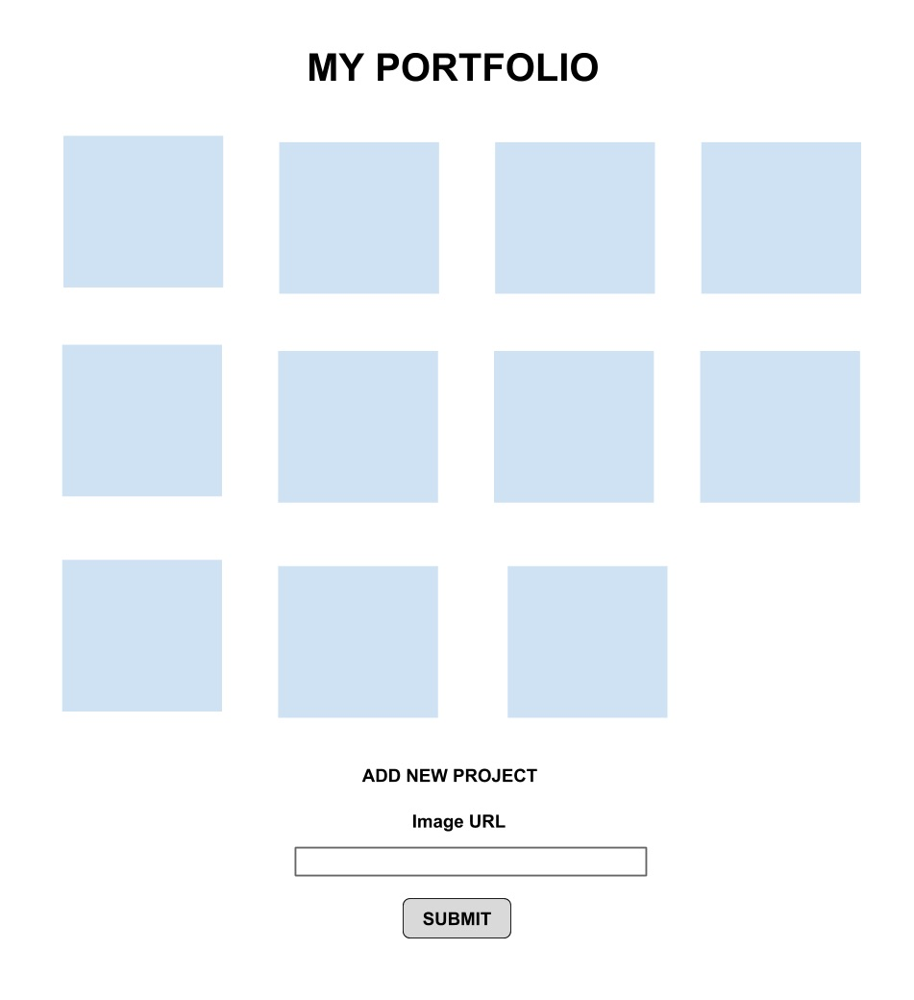
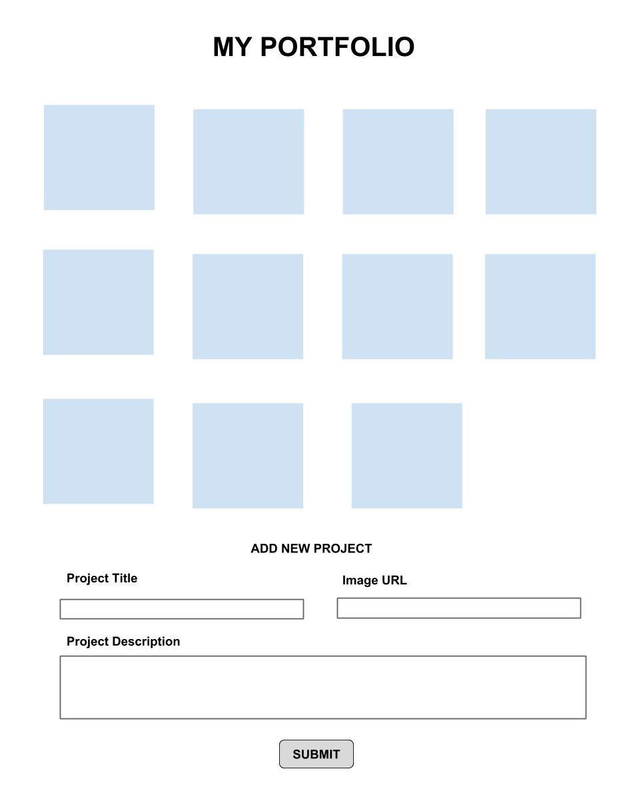
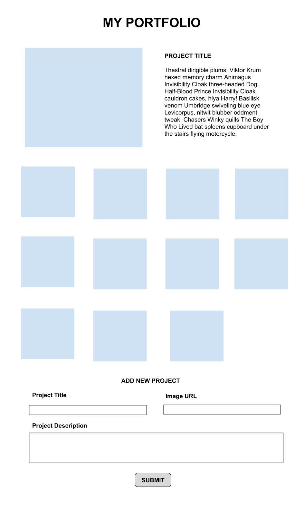

# Plain JavaScript DOM Manipulations.

In this repository, you will practice manipulating the DOM directly by creating a portfolio.

## Objectives

- Manipulate the DOM directly through by appending and removing DOM elements.
- Use CSS to style elements on the page.
- Add event handlers to interact with user actions on the page.

## Setup

Open `index.html` in the browser.

## Basic Requirements

_Note: Do not use jQuery for any of this! The purpose of this activity is to make you comfortable with DOM manipulations using plain JavaScript._

### 1. Create a form that adds images to the page.

- [ ] Add functionality.
  - This form should accept a URL.
  - This form should have a "submit" button.
  - After clicking the button, the image should appear at the top of the page.
- [ ] Add styling.
  - Everything should be center-aligned.
  - Images should be positioned in a grid pattern so that they appear four across. You can do this with plain CSS, or you can use Bootstrap if you're familiar with it.

### 2. Add additional fields to the form.

- [ ] Add functionality.
  - Create an input text box for the project title.
  - Add a larger text box (look up `textarea`) for the project description.
  - This information should be stored somewhere, but you should not display it yet. Hint: create any variables you need to store every project's information: the title, description and image.
- [ ] Add styling.
  - See image above – title and image filed are on the same line, and project description gets its own line.

### 3. Create a featured image section

- [ ] Add functionality
  - If there are no images on the page yet, nothing should be displayed
  - Clicking on any images should show/replace the featured image with other images.
- [ ] Add styling.
  - The featured image should be on the left, and the title and description should be on the right.

### 4. Improve styling

- [ ] Play with the styling so this looks as professional as possible!

## Resources

- [MDN - Manipulating the DOM Guide](https://developer.mozilla.org/en-US/docs/Learn/JavaScript/Client-side_web_APIs/Manipulating_documents)
- [Plain JS - Common DOM Manipulation methods](https://plainjs.com/javascript/manipulation/)
- [Eloquent JavaScript - The DOM](https://eloquentjavascript.net/14_dom.html)
- [Eloquent JavaScript - Handling Events](https://eloquentjavascript.net/15_event.html)

## Notes

_This is a student project that was created at [CodeOp](http://CodeOp.tech), a full stack development bootcamp in Barcelona._
